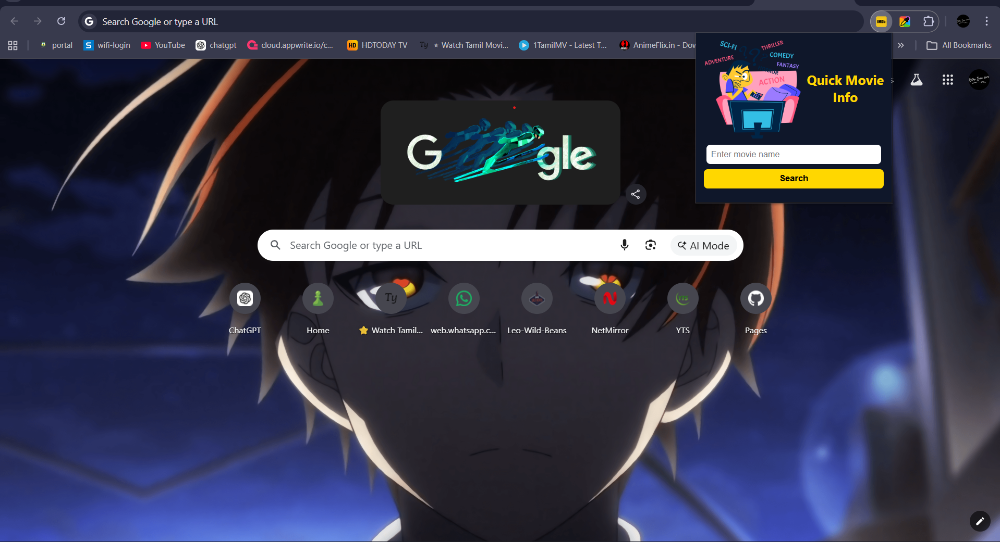
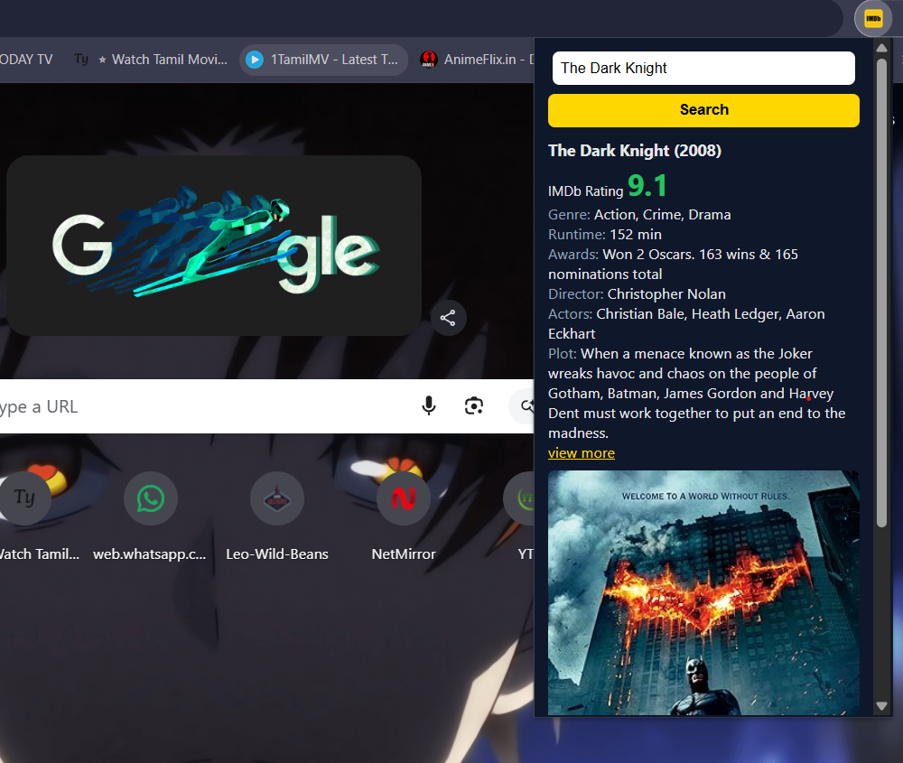

# 🎬 Quick Movie Info — Chrome Extension





A lightweight Chrome extension that instantly fetches movie details when you search for a movie title.
This extension helps users quickly access movie information without opening multiple tabs.

---

## 🚀 Features

* Search movies directly from the browser
* Fetch movie data using an API
* Lightweight and fast
* Simple popup UI
* Easy to install locally

---

## 🧰 Tech Stack

* JavaScript
* HTML
* CSS
* Chrome Extension API
* Movie API (OMDb or similar)

---

## 📸 Preview



## 📁 Project Structure

```
Quick-movie-info-chrome-extension
│
├── manifest.json
├── popup.html
├── popup.js
├── style.css
└── icons/
```

---

## ⚙️ Installation (Chrome Extension)

1. Download or clone this repository

```
git clone https://github.com/1826266272/Quick-movie-info-chrome-extension.git
```

2. Open Chrome and go to:

```
chrome://extensions/
```

3. Enable **Developer mode**
4. Click **Load unpacked**
5. Select the project folder

The extension will now appear in your browser.

---

## 🧠 What I Learned

* Building Chrome extensions using Manifest
* Fetching API data with JavaScript
* Designing popup UI for extensions
* Managing extension permissions
* Debugging browser extensions

---

## 👨‍💻 Author

Sethu
Frontend Developer in progress 🚀
